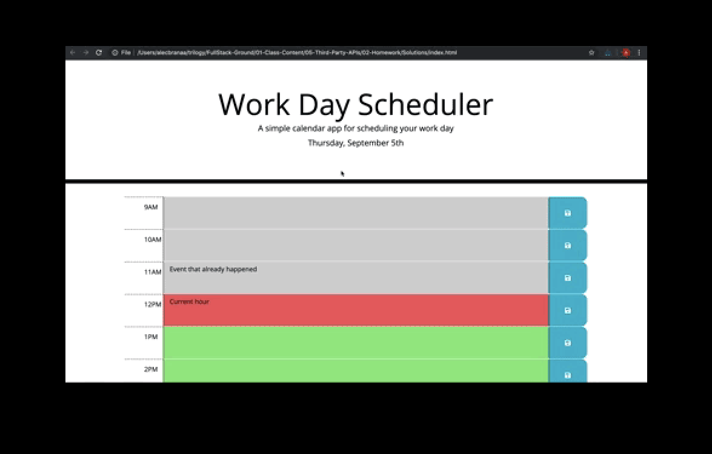
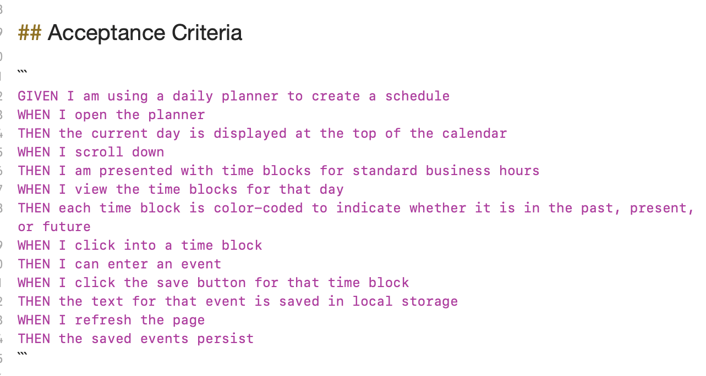

For this assignment we had to make a Day Planner.   It had to hold a schedule for a 9-5 work day, with an ability to add things to each hour.  This was the end goal: .
The following was the acceptance criteria for the assignment:
.
The only assest provided was the CSS, so all other things had to be determined via the CSS.
I decided to use bootstrap, just for ease of lining up all of the rows and the columns within.
I intially started by reverse engineering the index page by using the CSS styling as a guide.  I started by creating a row for each hour that was in the work day.  I then added data values to each of the rows, upon the recommendation of a TA in class.  I changed some of the CSS  just so I could visualize where the rows and columns were lining up with each other.  I had to change some height and width elements and remove a few styles that were interfering with my page properly displaying.  I then added moment.js to my javascript.  Additionally, after having closely inspected moment.js, I realized that I had to change the time to military time in order to be able to have a function that would properly display if the time was past, present, or future.  
I moved the data-value to the text area, so I was able to change the color of that area by using my function for it.  
I had doubled up a window onload function within my already running jQuery code.   A tutor helped me realize that I only needed the one.   It appeared as if the function was working properly.  All of the spaces were grey in background (although it was late at night and I didn't have a chance to see what happened with a time that wasn't expired).  
I moved my JS and my CSS to an assets files.  I was told that this was best practice for future projects.  I changed the reference on the page as well.
Next up I added IDs and a Placeholder text to the textarea.  I was intially thinking that each individual ID would be stored to do something with.  Foretunately I remebered the magic of jQuery!
I started to run into issues trying to traverse the DOM to get information using $this.  I intially was attempting ids on buttons and textareas.  Unfortunately, this would mean having to do each one individually instead of using the each function.   In order to create ease (for myself) while traversing the DOM, I removed the extra divs.  I instead used the bootstrap class in both the textarea and button classes.  It also made the styling of my page better.  To help with this, I added ids to the rows.   This made it easier for me to write the save button function.   With the onclick, I was able to use the id from the row to create a time value.  I then used this value as a parameter for the local storage.  Later, with the set storage, the information would return back to the correct time slot, since the key from the local storage matched the id of the row.
I then attempted to find out the value of the textarea, to make sure the inputs were storing properly.
Lo and behold, I was working during the day...and my classes were not matching up.  :expressionless:  So I used my element tool in the console, and realized that it was assigning all of the classes to each row.   Further investigation made me realize that I had only run the function for the first time slot, not for EACH time slot.  :grimacing:  I fixed it and the function worked.  Great success!
Next I added a setCalendar function.   This was to set information from local storage to my page.  I haven't the slightest idea why, but this is also where I decided to stringify my setItem.  I think because we went over it in class, I thought it should be done?  Well because of that I had all of the strings coming back in quotes.  :anguished:  I reached out to my instructor.  He said that because we were storing strings, and not objects, it was unnecessary to use the JSON method here.  
For my final roadblock, I kept not being able to get information from storage.  It was driving me bonkers.  I reached out to a tutor on the ask BCS.  At the same time I recognized the errant code.  It was this snippet $(this).children("textarea").val($activity).  I didn't need a this children, just a $this.val().   With this, my page was complete!:sparkles:
Here is my page in action:
I felt a bit more confident using jQuery this time around, so there was the teeny, tiniest bit of ease doing this assignment as compared to the last one.
