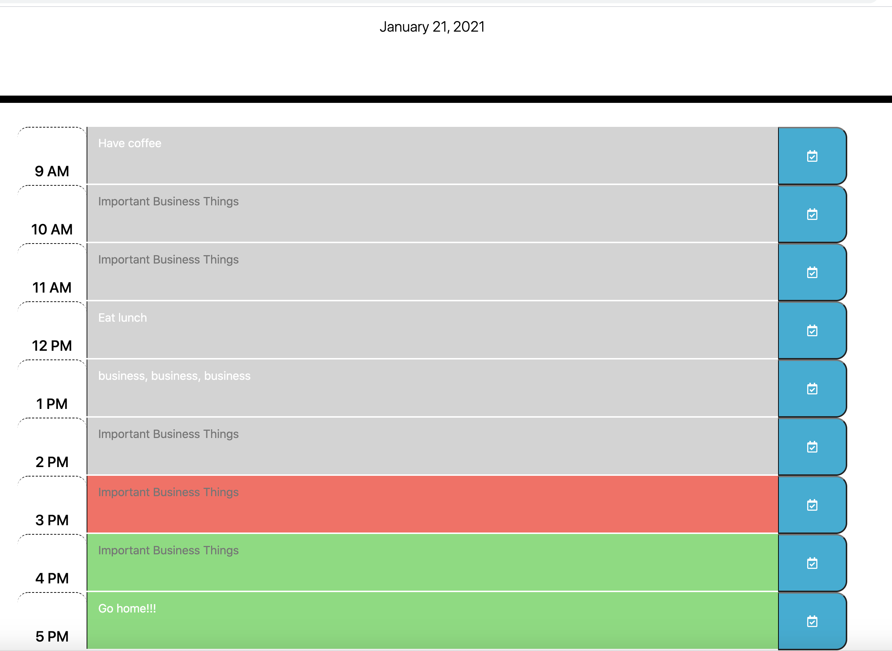

 
# 
 **Day Planner**

## 
**Table of Contents**: 

* [Description](#description)
* [Technologies](#technologies)
* [Usage](#usage)
* [Visuals](#visuals)
* [Contributing](#contributing)
* [Questions](#questions)
* [License](#license)

## 
 <a name="description"> **Description** :</a>
 

Tasked with creating a day planner that a user could utilize to plan a business day at work.   The website should have specific colors based on the time of day (past, present, future) and when a user leaves and returns, the information should persist on the page.

## 
 <a name="technologies"> **Technologies** :
 

### HTML
### CSS
### Bootstrap
### JavaScript
### jQuery
### moment.js
### Local Storage
### JSON

## 
<a name="usage"> **Usage** :</a>

This is a Day Planner for the user.   The planner holds the current date and time.  The user has the ability to store information to certain time blocks during the day.   All hours that have passed are grey in color, the current hour is red, and future hours are green.   When the user leaves the page and comes back, previously entered information will populate to the page.  

### 
 The Webpage : 

 https://ckhilpisch.github.io/Password_Creator/

 
 

## 
<a name="visuals"> **Visuals** :</a>

### 
 **The Website** :

https://ckhilpisch.github.io/DayPlanner/

## 
<a name="contributing"> **Contributing** :</a>

Pull requests are always welcome.  When contributing to this repository, please first discuss the change you wish to make via email or issue.  
After approval, please follow the "fork-and-pull" Git workflow.
<ol>
<li>Fork the repo on GitHub</li>
<li>Clone the project to your own machine</li>
<li>Commit changes to your own branch</li>
<li>Push your work back up to your fork</li>
<li>Submit a Pull request so that we can review your changes</li>
</ol>

## 
<a name="questions"> **Questions** :</a>

If you have any questions, feel free to reach out to me.   My email is ckhilpisch@gmail.com.

## 
 <a name="license"> **License** : 
 

MIT License
Informataion avaiable here: 
https://opensource.org/licenses/MIT
